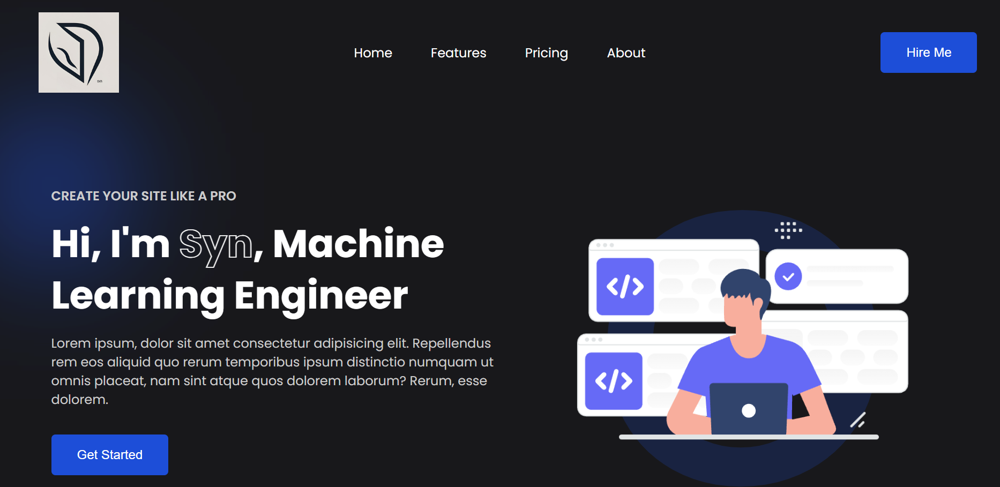

# Portfolio Website 🚀✨

Selamat datang di repository **Portfolio Website**! 🌟 Website ini dirancang untuk memperkenalkan diriku, keterampilan, dan layanan yang dapat kuberikan. Berikut adalah detail tentang struktur dan fitur portfolio ini. 😊

---

## Fitur-Fitur Utama ✨

### 1. **Halaman Awal** 🏠
   - Perkenalan singkat dengan nama dan profesiku. 👋
   - Desain menarik yang memberikan kesan profesional dan kreatif. 🎨

### 2. **YouTube Section** ▶️
   - Menampilkan link ke channel YouTube-ku. 📺
   - Showcase konten video terkait skill dan pengalaman profesionalku. 🎥

### 3. **About Me** 📖
   - Penjelasan tentang diriku, latar belakang, pengalaman kerja, dan keterampilan utama. 💼
   - Menampilkan daftar tools dan teknologi yang biasa kugunakan. ⚙️

### 4. **Contact** 📬
   - Formulir kontak untuk mempermudah orang menghubungi aku. 📞
   - Informasi media sosial dan email untuk koneksi lebih lanjut. 🌐

### 5. **Hal yang Bisa Kubantu** 🤝
   - Daftar layanan atau bantuan yang dapat kuberikan, seperti:
     - Pengembangan website 🌐
     - Desain UI/UX 🎨
     - Optimasi SEO dan pemasaran digital 📈
     - Konsultasi teknologi 📚

---

## Screenshot 📸

### Halaman Awal 🏠



### Tentang Saya 📖


### Kontak 📬


---

## Teknologi yang Digunakan 🖥️

- **HTML5** 🌐
- **CSS3** 🎨
- **JavaScript** ⚙️
- **React.js** ⚛️

---

## Cara Menjalankan Proyek 🚀

1. Clone repository ini:
   ```bash
   git clone https://github.com/your-username/portfolio-website.git
   ```
2. Masuk ke direktori proyek:
   ```bash
   cd portfolio-website
   ```
3. Install dependencies:
   ```bash
   npm install
   ```
4. Jalankan server pengembangan:
   ```bash
   npm start
   ```

---

## Kontribusi 🤝

Kami sangat menghargai kontribusi! Jika kamu memiliki ide baru, menemukan bug, atau ingin menambahkan fitur, silakan fork repository ini dan ajukan pull request.

---

## Lisensi 📜

Proyek ini dilisensikan di bawah [MIT License](LICENSE).

---

Dibuat dengan ❤️ oleh [syn]
